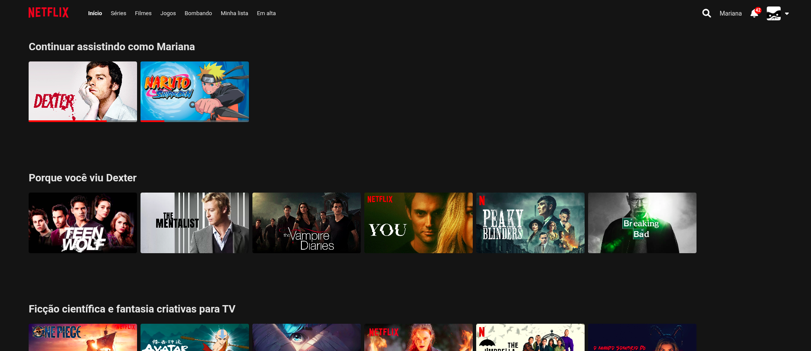

# 🎬 Netflix Clone - Imersão Front-End Alura

Repositório do projeto desenvolvido durante a **Imersão Front-End da Alura**. O objetivo foi recriar a interface da Netflix, focando em layouts responsivos, manipulação de dados dinâmicos com JavaScript e estilização avançada com CSS.



## 🎯 Objetivo do Projeto
Construir um catálogo de filmes e séries funcional, onde o usuário pode visualizar categorias, ver barras de progresso em itens "continuar assistindo" e assistir a trailers diretamente ao passar o mouse (hover) sobre os cards.

---

## 🚀 Tecnologias Utilizadas
O projeto foi construído utilizando as tecnologias fundamentais da web:

* **HTML5**: Estrutura semântica do catálogo e componentes.
* **CSS3**: Flexbox, CSS Grid, variáveis (`:root`) e animações de zoom/hover.
* **JavaScript (ES6+)**: Consumo de dados de arquivos externos (`data.js`), manipulação do DOM e lógica de reprodução de vídeos.
* **Font Awesome**: Ícones para a interface e redes sociais.
* **Google Fonts**: Tipografia padrão da Netflix (Roboto/Helvetica).

---

## 🛠️ Funcionalidades
- [x] **Navbar Responsiva**: Menu que se adapta a diferentes tamanhos de tela.
- [x] **Cards Dinâmicos**: Gerados via JavaScript a partir de uma base de dados.
- [x] **Efeito Hover Premium**: Ao passar o mouse, o card aumenta de tamanho e inicia o trailer (iframe do YouTube).
- [x] **Sistema de Badges**: Identificação de "Top 10", "Novo Episódio" e "Indisponível em breve".
- [x] **Rodapé Fiel**: Layout de 4 colunas com ícones sociais e links institucionais.

---

## 📦 Como rodar o projeto
1. Clone este repositório:
   ```bash
   git clone https://github.com/marianinhaUFMT/netflix-plataform.git
   ```
2. Navegue até a pasta do projeto:
   ```bash
   cd netflix-plataform
   ```
3. Abra o arquivo `index.html` no seu navegador ou utilize a extensão **Live Server** no VS Code.

---

## 🎨 Preview da Estrutura de Dados
O projeto utiliza um arquivo `data.js` para facilitar a manutenção do catálogo:

```javascript
export const categories = [
    {
        title: "Continuar assistindo como Mariana",
        items: [
            { img: "link-da-imagem", progress: 45, youtube: "link-do-video" }
        ]
    }
];
```

---

## 👨‍💻 Autor
Desenvolvido por **Mariana** durante a Imersão Alura AI/Front-End.
